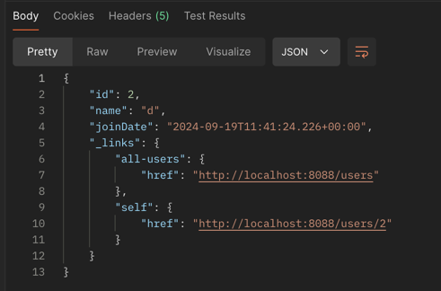

- exception handling
- internationalization (메시지 국제화)
- validation (Entity 유효성 검증)
- filtering (응답 json 필터링)
- versioning (api 버전관리)
- HATEOAS
  - 
  - 서버가 클라이언트에게 리소스와 함께 해당 리소스에 대한 링크 정보를 제공하는 패턴인 HATEOAS(Hypermedia As The Engine Of Application State)
  - **자체 설명형 API** : API 응답에 다음 가능한 액션에 대한 링크가 포함되어 있어 클라이언트가 추가 요청을 쉽게 이해할 수 있음.
  - **유연성** : API URI가 변경되어도 클라이언트는 응답에서 제공된 링크를 따라가면 되므로 URI가 직접적으로 하드코딩될 필요가 없다.
  - **확장성** : 새로운 기능이 추가되어도 클라이언트는 새로운 엔드포인트나 액션을 쉽게 알 수 있다.
- swagger (api 문서)
- actuator (모니터링)
- HAL explorer
- JPA
